# TA Subscriptions Plugin

Este plugin fue desarrollado como parte de una estrategia **Open Source** para medios de todo el mundo basada en el CMS **WordPress**.  
Haciendo click en este [enlace](https://tiempoar.com.ar/proyecto-colaborativo/) se puede encontrar más información sobre el proyecto, así como las lista de plugins que complementan a este para tener un sitio completamente funcional.

* * *

Suscripciones es un plugin para medios gráficos o periódicos online, pensado para medios de Argentina en un primer momento pero extensible a cualquier región del mundo.
Por defecto, el realiza el débito automático por Mercadopago y cuenta con una opción para crear un débito automático por banco, pero de forma manual ya que no se cuenta con API de entidades bancarias. Ambos medios de pago son configurables por el usuario.

Al ser un plugin, se pueden extender o agregar los medios de pago que se necesiten para extender el plugin.

El plugin se creó de forma que pueda ser editable el front a gusto del usuario por cualquier desarrollador, ya que se siguió las recomendaciones y documentación base de Wordpress. De esta forma, utilizando la gran comunidad con la que cuenta Wordpress, las respuestas a dudas que no estén en esta documentación (a nivel técnico) se pueden encontrar en el Codex de Wordpress o en los numerosos foros y blogs técnicos de la Web.

En cuanto a Mercadopago, cuenta con documentación que dejamos en el siguiente enlace:

### [Mercadopago Docs](https://www.mercadopago.com.ar/developers/es/guides)

Se puede acceder específicamente a la parte de suscripciones desde el este [enlance](https://www.mercadopago.com.ar/developers/es/guides/online-payments/subscriptions/introduction).


**[Ver Video Presentación](https://drive.google.com/file/d/1_4TFndl8cGIItw0UU3PLMvjVCTt3m4K1/view?usp=sharing)**

## Documentación

### Instalación

Para instalar el plugin, primero debe clonarlo o descargarlo de este repositorio:

[GitHub](https://github.com/TiempoArgentino/ta-suscriptions)

Clonar:

**`$ git clone https://github.com/TiempoArgentino/ta-suscriptions.git`**

Descargar: en la pestaña code boton code (verde) del repositorio, descargar desde **Download ZIP** como se muestra en la imagen:  
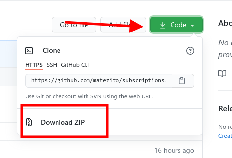

Una vez clonado o descargado, se debe mover la carpeta **subscriptions** al directorio

**`wp-content/plugins`**

de su instalación de Wordpress.

**IMPORTANTE**  
Tenga en cuenta que la carpeta **subscriptions-main** debe ser renombrada a **subscriptions** o puede haber problemas con la instalación.

Una vez que se descomprime y renombra la carpeta, nos dirigimos a la lista de plugins, buscamos **Subscriptions** o **Suscripciones**(según su idioma) y lo activamos.


Más información sobre manejo de plugins (en Inglés):**[Wordpress Codex Plugins](https://wordpress.org/support/article/managing-plugins/)**

Se debe extender las funciones con el plugin User Panel, especialmente creado para acompañar a Suscriciones.  
El plugin se puede descargar o clonar de este repositorio:  
[GitHub](https://github.com/TiempoArgentino/ta-user-panel)

Al igual que con Suscripciones, una vez clonado o descomprimido, se debe renombrar la carpeta a **user-panel** y pasarla a **wp-content/plugins**, luego activar el plugin desde la lista de plugins de la instalación de Wordpress.

### Configuración

Con el plugin ya instalado y activo, nos dirigimos al nuevo menú creado **Subscriptions** o **Suscripciones** según su idioma:  
  
En esta parte nos encontramos con los siguientes submenus:  


- [Suscripciones (presentación)](#presentacion)
- [Suscripciones](#suscripciones)
- [Membresías](#membresias)
- [Emails y Estados](#emails)
- [Opciones de pago](#pagos)
- [Opciones](#configuracion)
- [Plugin Options](#options)
- [Plugin Actions](#actions)

**[Video Tutoriales](https://drive.google.com/file/d/1igrCUDU-hf_FEd00ldjFQyUA_ZJZvLGQ/view?usp=sharing)**

**<a id="presentacion"></a>Suscripciones (presentación)**

Breve resumen de la función principal del plugin y enlaces a documentación.

**<a id="suscripciones"></a>Suscripciones**

En esta parte podemos crear, editar y borrar las suscripciones propiamente dichas

[Crear](#crear)

**<a id="membresias"></a>Membresías**

En esta pantalla encontramos todas las membresías activas, sus renovaciones y cancelaciones.

Ver [Manejo de membresías](#mem-conf)

**<a id="emails"></a>Emails y Estados**

En esta pantalla encontramos los estados y emails que se envian al cliente, podemos configurar los textos por ejemplo, o crear nuevos estados para el uso en membresías de ser necesario.

Ver [Configuración de Emails y Estados](#email-conf)

**<a id="pagos"></a>Opciones de pago**

Pantalla de configuración de medios de pago.

Ver [Configuración de Medios Pago](#pagos-conf)

**<a id="configuracion"></a>Opciones**

Configuración general de todo el plugin y sus opciones.

Ver [Configuración básica del plugin](#opciones-conf)

### <a id="crear"></a>Crear Suscripciones

Primero, debemos recordar que Suscripciones o Subscriptions es un POST TYPE que funciona muy parecido a una entrada básica de Wordpress, más información:  
[https://developer.wordpress.org/themes/basics/post-types/](https://developer.wordpress.org/themes/basics/post-types/)

Para crear suscripciones no dirigimos al menú Suscripciones en nuestro administrador, Nueva Suscripción (recuerde que esto puede estar en inglés, según la configuración de su instalación).

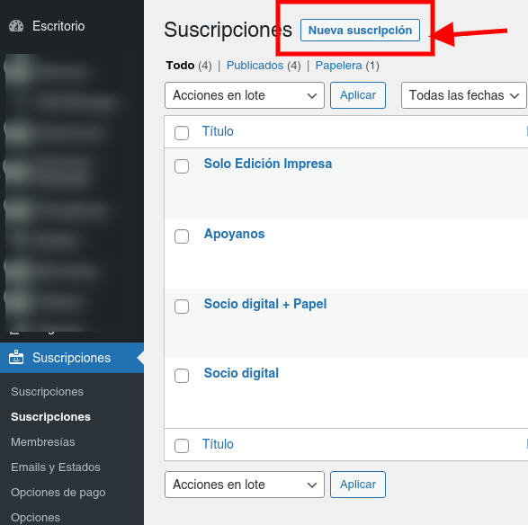

Al hacer click en el botón vemos lo siguiente:

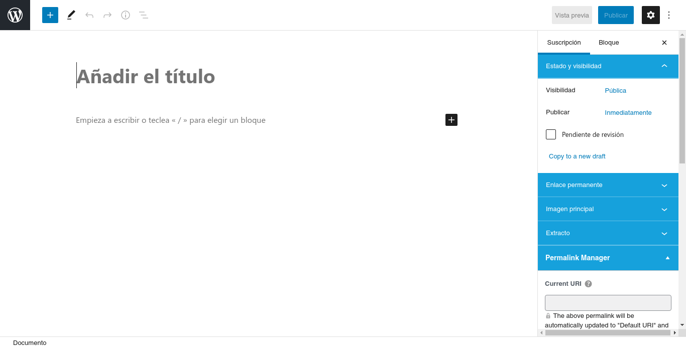

En el campo “Título” (Añadir título), agregamos el nombre de la nueva suscripción.  
Luego podemos agregar una descripción del mismo.  
Nos movemos a la barra de opciones del lado derecho, donde tenemos 2 opciones **Suscripción** y **Bloque**.  
Las opciones a configurar para la creación de la suscripción se encuentran en la pestaña **Suscripción**.  
Las opciones básicas como **Estado y Visibilidad e Imagen Principal** son propias de Wordpress, por lo que aquí veremos solo lo que pertenece a Suscripciones.

**Opciones y Detalles**  
Opciones y detalles es lo básico para la creación de una suscripción.

---

**Precios:** Podemos agregar uno (1) principal y varios alternativos, siempre en número y puede conetener decimales de ser necesario. También podemos activar la opción de recibir un monto definido por el usuario. Este monto se valida para que no sea menor al minimo de la suscripción.


**Periodo:** Aquí definimos el periodo de suscripción puede ser en días o meses. Por ejemplo, para 1 (un) mes, se puede usar 30 días o 1 mes. Si bien esto se puede configurar según la necesidad del proyecto, siempre hay que tener en cuenta que depende de los tiempos de suscripción o membresía que acepten los medios de pago configurados.


**Direcciones:** Por último, la opción de **¿Tiene un producto físico con envío?** nos permite activar un formulario para solicitar una dirección al nuevo miembro, por si es necesario enviarle un producto físico.


**Mercadopago Plan ID** En el caso de tener activo el medio de pago Mercadopago (Argentina), la siguiente opción es para agregar el ID del plan creado en la cuenta de Mercadopago para aceptar las suscripciones o membresías.

[Ver configuración de Pagos](#pagos-conf)

[Ver Video](https://drive.google.com/file/d/1v5LF7ubyFa6xbHy5xbZgt_k0st48diuV/view?usp=sharing)

### <a id="mem-conf"></a>Membresías

En el menú Suscripciones -> Membresías (nuevamente, según su idioma) encontramos todos los pedidos / suscripciones / ordenes creadas por los suscriptores.

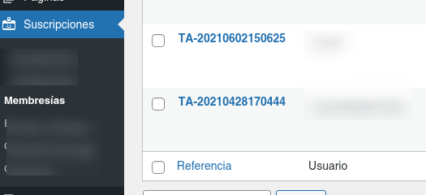

La lista de Membresías se ve de la siguiente manera:

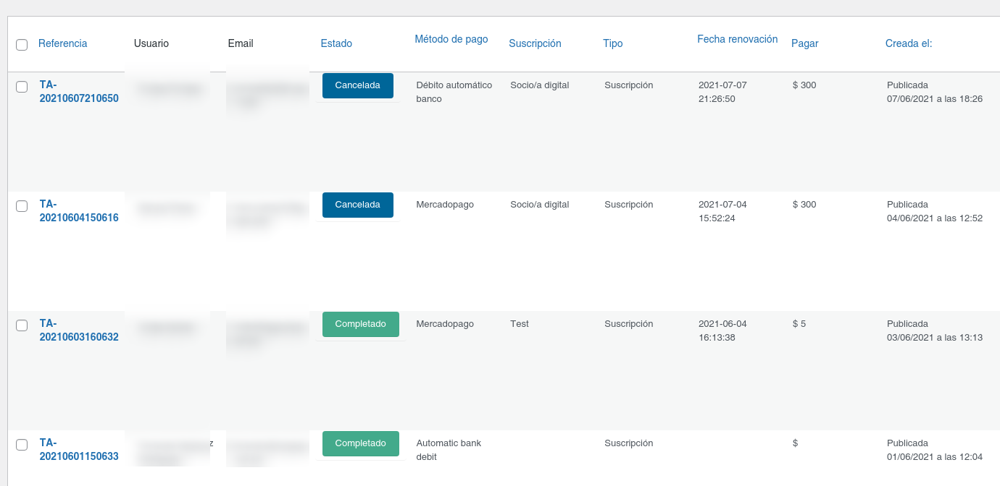

En esta lista encontramos los siguientes items:  
**Referencia:** Un código alfanumérico que sirve de referencia del pago.  
**Usuario:** Nombre del miembro / suscriptor.  
**Email:** Email de miembre / suscriptor.  
**Estoda:** Estado de la membresía, estos pueden ser (por defecto), Completado, Cancelado, En espera, Renovación, Error.  
**Método de pago:** Método con el cual pago el miembre.  
**Suscripción:** Nombre de la suscripción que eligió el miembro. **Tipo:** Puede ser Suscripción o Donación (todavía en desarrollo). **Fecha de renovación:** Fecha de la próxima renovación de la membresía.

Ingresando a la membresía (haciendo click sobre la referencia), encontramos la siguiente pantalla:

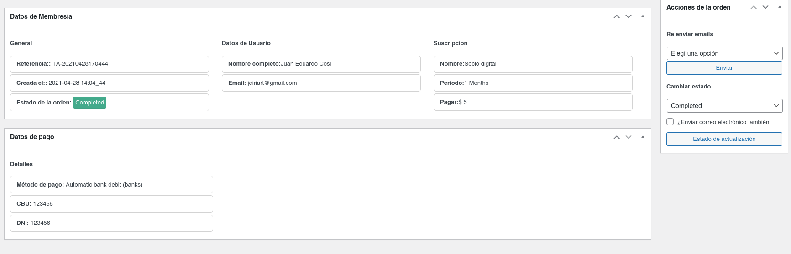

En esta pantalla encontramos primero los **Datos de la membresía.** En esta sección vamos a encontrar al información básica de la membresía creada.

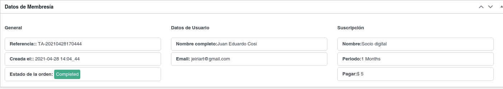

Debajo de esto encontramos los **Datos del pago**. Esta sección cambia según el medio de pago elegido, en este caso vemos una membresía creada con Débito Bancario. Estos datos cambian y se amplían según el medio de pago.


En el menú de la derecha encontramos estas dos opciones para el manejo de membresías:


**Reenviar email:** Esta opción nos permite re enviar el email de bienvenida al usuario en el caso de ser necesario, o reenviar el email con los datos de la membresía.  
**Cambiar estado:** Como su nombre lo indica, con esta opción podemos pasar de un estado a otro la membresía, por ejemplo, en el caso de los pagos por Débito Bancario, de los cuales, el estado es "En Espera", se pueden validar pasandolos a "Completado". La opción permite que se le envíe un email con el estado nuevo al suscriptor.

[Ver Video 1](https://drive.google.com/file/d/1P19WFHHv6jKnQLIFe1Isd5Wpdz-_VRza/view?usp=sharing)

[Ver Video 2](https://drive.google.com/file/d/1V5J3Zfd42msL4efPrvjXPowl_75BpADk/view?usp=sharing)

### <a id="email-conf"></a>Emails y estados

En el menu de **Email y estados** se encuentra la configuración para los emails transaccionales que el sistema envía a los usuarios al suscribirse o dar de baja una suscripción, así como los estados de las membresias.

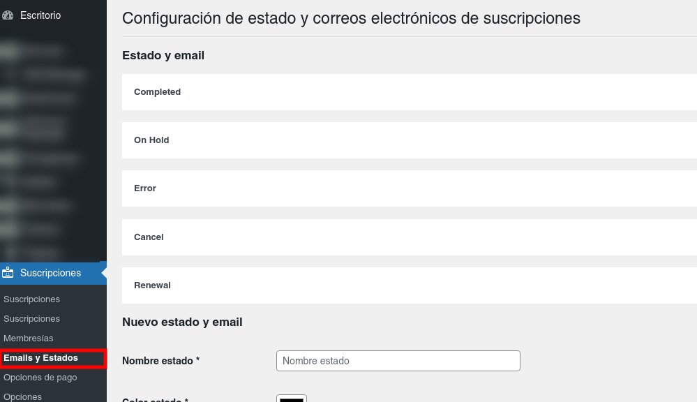

Los estados por defecto son:

- **Completed / Completado**  
  Para todas las suscripciones en las cuales el proceso termino con exito.
- **On Hold / Espera**  
  Para las suscripciones realizadas con medios de pago Offline, como Débito Bancario.
- **Error**  
  Para las suscripciones en las que hubo un error con el pago.
- **Cancel / Canceleda**  
  Para las suscripciones que son canceladas por el miembro.

Adicional, econtramos el estado **Renewal / Renovación** para todas las renovaciones automáticas.

Todos estos estados tienen un email asignado (menos Renovación). Haciendo click sobre cada uno, podemos modificar el email enviado al miembro en cada caso:

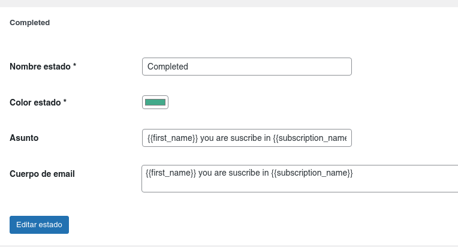

Para la edición:  
**Nombre estado**: Es el nombre que veremos en la lista de membresías.  
**Color**: El color con que veremos el estado en las lista de membresías.  
**Asunto**: El asunto con que el email le llegará al suscriptor / miembro.  
**Cuerpo del email**: El texto por defecto del email que le llegará al suscriptor / miembro.  
En esta parte podemos usar "tags" para personalizar el Asunto y Cuerpo, las "tags" son las siguientes:

- **Para en nombre** {{first_name}}
- **Para el apellido** {{last_name}}
- **Para el email** {{email}}
- **Nombre de la suscripción** {{subscription_name}}

Adicional, podemos crear nuestros estados personalizados de ser necesario.  
  
Este nuevo estado se puede utilizar en las membresías.

[Ver Video](https://drive.google.com/drive/folders/1bzfgPDHa3ZuDFIj9K0k4dMuF1eY-ULtd?usp=sharing)

### <a id="pagos-conf"></a>Medios de Pago

La configuración de Medios de Pago se encuentra en **Suscripciones > Opciones de pago**, allí encontramos la configuración para los dos medios de pago por defecto del plugin, en esta zona también de deberían encontrar los medios de pago personalizados en caso que haya


##### Mercadopago

Los datos necesarios para la configuración de Mercadopago son: **Public Key, Access Token y Collector ID**, estos datos se puede conseguir la pantalla de credenciales de Mercadopago [Ver credenciales](https://www.mercadopago.com.ar/developers/panel/credentials)

La pantalla de credenciales se ve como esta:

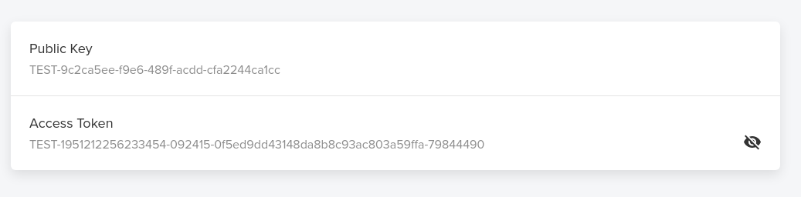

El Collector ID es la última parte del token de nuestras credenciales:

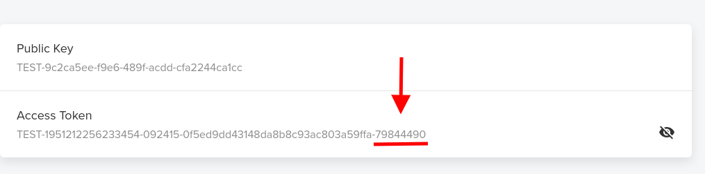

Para crear una suscripción en su cuenta de Mercadopago, debe dirigirse a [](https://www.mercadopago.com.ar/)e ingresar a la cuenta. Dentro del menú de la izquierda debe ir a Suscripciones -> Crear nueva suscripción:


Una vez creada la suscripción, en la url tendremos un parámetro llamado ID, parecido a esto se verá:

https://www.mercadopago.com.ar/subscription-plans/share?**id=2c93808479cfe0100179d7a8c6f907ce**

Copiamos la cadena que esta despues de **id=** y la pegamos en el siguiente campo:


Con esto configuramos el plan al cual las suscripciones se agregaran para tener todo ordenado y tener las funciones de cambio de precio activas. Es decir, cuando cambiemos el plan, se cambia el precio para todos nuestros suscriptores que pertenezcan a ese plan en particular.

**IMPORTANTE**  
Las suscripciones en Mercadopago deben ser creadas con la opción **Prefiero que el cliente lo defina** en el precio.

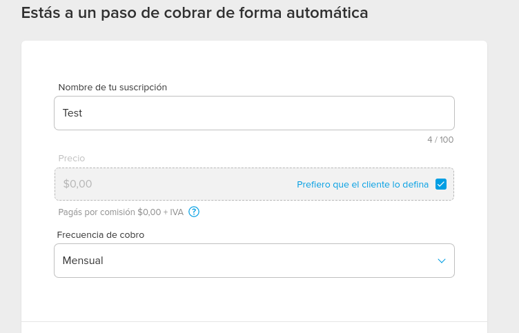

Una vez configurado todo esto, tenemos que configurar las notificaciones IPN de Mercadopago, ver la documentación [aquí](https://www.mercadopago.com.ar/developers/es/guides/notifications/ipn).  
Debe ingresar a [https://www.mercadopago.com.ar/developers/panel/notifications/ipn](https://www.mercadopago.com.ar/developers/panel/notifications/ipn) e ingresar la siguiente configuración.

En **URL del sitio en producción** debe poner la URL de su sitio apuntando a /notification, de esta manera: https://{urldelsitio}/notifications/, recuerde que sin SSL (https) Mercadopago **NO funciona**.

En la parte de **Eventos** seleccionar **Pagos (Payments)**.

La configuración debe quedar de la siguiente manera:

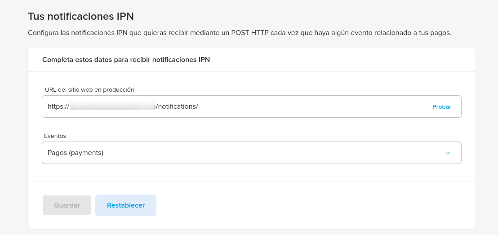

##### Débito Bancario

El débito bancario no tiene configuración en si mismo ya que el suscriptor agrega sus datos para que de forma manual se pueda agregar al débito bancario mensual. Este tipo de medio de pago es offline, por lo cual, si el suscriptor lo selecciona, para darle el alta final hay que hay hacerlo de manera manual, entrando a la membresía creada.

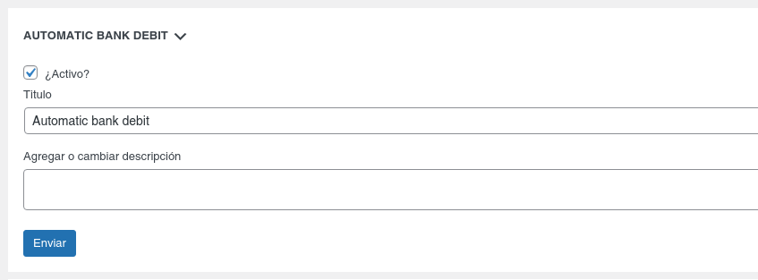

[Ver Video](https://drive.google.com/file/d/1ScmthO_BUvl1JsJcqoSuWIR6szycNnvd/view?usp=sharing)


### <a id="opciones-conf"></a>Opciones (configuración global)

En las opciones generales tenemos varios items, los primeros son una opción para cargar (o no), Bootsrap para usar en el front:


Esta opción esta disponible de esta forma por si ya nuestro front tienen Bootstrap. De esta forma, no se sobre escriben las clases o js.

Como segunda opción, tenemos el **Contenido Privado**. Esta opción nos permite activar usar (o no) el contenido, privado, adicional, podemos elegir a que tipo de post (Post type), se lo asignaremos, así como asignar un mensaje para mostrar cuando el contenido es privado.


La siguiente opción nos permite elegir el rol por defecto para los sucriptores, por defecto es **Suscriptor**.


La siguiente opción es para la **configuración de moneda**, aquí podemos elegir el simbolo de la moneda y el prefijo a mostrar en la lista de membresía, este prefijo es usado cuando se genera la referncia de la orden / membresía.


La opción de **Páginas** es una de las más importantes. Al momento de activar el plugin, este genera una serie de páginas necesarias para el funcionamiento correcto.

- **Página principal** La página donde se mostraran las suscripciones.
- **Página de gracias** Esta página esta al finalizar el pago
- **Ingresar** Página de login
- **Página de registro**Formulario de registro
- **Perfil**Página donde se mostrará la información del usuario
- **Página de Pago**Página donde se muestran los medios de pago activos
- **Términos y condiciones**Términos y condiciones del servicio
- **Donaciones**Mejora en proceso

Estas páginas se crean en el menú **Páginas** de forma automática, al desactivar el plugin, estas páginas se eliminan. Una vez creadas, podemos cambiar tanto el título como el slug de la página en cuestión por alguno de nuestra preferencia.

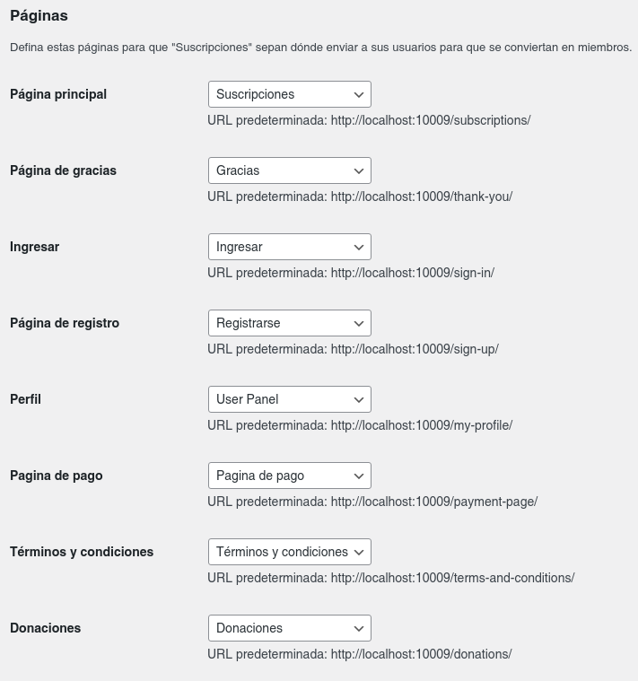

La **Opción de Emails** se refiere a la configuración del lado del administrador, es decir, el remitente por un lado y por otro los emails que recibirá el administrador al momento de nuevo registro de usuario y email de bienvenida al sitio.


Esto es editable por supuesto, y se pueden usar las siguiente "tags":

- **Para en nombre** {{first_name}}
- **Para el apellido** {{last_name}}
- **Para el email** {{email}}
- **Nombre de la suscripción** {{subscription_name}}
- **Nombre del sitio** {{site_name}}

[Ver Video](https://drive.google.com/file/d/1B8utIkxElfmOLO1U_g734GMv8_k5hzZI/view?usp=sharing)

### <a id="disenio"></a> Diseño y plantillas

El plugin cuenta con un front ya creado que se encuentra en la carpeta:

**`public/partials`**

en la carpeta "public" también encontramos las carpetas "js" y "css", recomendamos no sobre escribir "js".

Dentro de partials encontramos dos carpetas **auth** y **pages**, copiando estas dos carpetas a su theme activo puede sobre escribir las funciones y diseño del plugin. Se realiza de la siguiente manera:

En el theme activo **(wp-content/themes/your-theme)** debe crear una carpeta llamada **subscriptions-theme** y dentro pegar las carpetas **auth** y **pages**. De esta forma, puede modificar los templates o plantillas del plugin. Recomendamos consevar nombres de campos o botones de formulario que cuenten con ellos, así como los ID de los mismos. En caso de modificar los mismos, deberá sobreescribir las funciones de js dentro de su theme.

**Estructura de carpetas**

```
*   /root
    *   wp-content
        *   themes
            *   main-theme / child-theme
                *   subscriptions-theme
                    *   pages
                    *   auth
```

### <a id="options"></a>Plugin options

*Aclaración*
El uso de esta opciones se pude hacer en otro plugin o en su theme directamente. Todas las opciones se llaman con:

```PHP
get_option('nombre_opcion')
```

Más información en el [Codex Wordpress](https://developer.wordpress.org/reference/functions/get_option/).

**Opciones re-utilizables**

<table>

<tbody>

<tr>

<th>default_sucription_role</th>

<td>Obtener rol por defecto de los suscriptores</td>

</tr>

<tr>

<th>subscriptions_currency_symbol</th>

<td>Obtener simbolo de moneda</td>

</tr>

<tr>

<th>member_sku_prefix</th>

<td>Obtener prefijo de referencia de membresías</td>

</tr>

<tr>

<th>subscriptions_loop_page</th>

<td>Obtener ID de página de suscripcionse</td>

</tr>

<tr>

<th>subscriptions_thankyou</th>

<td>Obtener ID de página de gracias</td>

</tr>

<tr>

<th>subscriptions_login_register_page</th>

<td>Obtener ID de página de login</td>

</tr>

<tr>

<th>subscriptions_register_page</th>

<td>Obtener ID de página de registro</td>

</tr>

<tr>

<th>subscriptions_profile</th>

<td>Obtener ID de página de perfil</td>

</tr>

<tr>

<th>subscriptions_payment_page</th>

<td>Obtener ID de página de pago</td>

</tr>

<tr>

<th>subscriptions_terms_page</th>

<td>Obtener ID de página de Términos y Condiciones</td>

</tr>

<tr>

<th>subscriptions_email_sender</th>

<td>Email de remitente (administrador por defecto)</td>

</tr>

<tr>

<th></th>

</tr>

</tbody>

</table>

### <a id="actions"></a>Plugin actions

Lista de acciones que se puede usar para extender el plugin. Se llaman:  

```PHP
add_action('action_hook','callback_function',priority, arguments)
```

Más información en [Codex Wordpress](https://developer.wordpress.org/reference/functions/add_action/)

**Actions**

<table>

<tbody>

<tr>

<th>before_subscriptions_loop</th>

<td>Antes del comienzo de la página de suscripciones</td>

</tr>

<tr>

<th>subscriptions_loop_footer</th>

<td>Footer de página de suscripciones</td>

</tr>

<tr>

<th>subscriptions_payment_page_header</th>

<td>Header página de pago</td>

</tr>

<tr>

<th>subscriptions_payment_page_message_before</th>

<td>Comienzo página de pago</td>

</tr>

<tr>

<th>subscriptions_payment_page_before_methods</th>

<td>Antes de mostrar los medios de pagos</td>

</tr>

<tr>

<th>payment_messages</th>

<td>Mostrar mensajes de los medios de pago</td>

</tr>

<tr>

<th>payment_getways</th>

<td>Gancho para mostrar los medios de pago</td>

</tr>

<tr>

<th>subscriptions_payment_page_after_methods</th>

<td>Después de los medios de pago</td>

</tr>

<tr>

<th>subscriptions_payment_page_message_after</th>

<td>Mensaje luego de los medios de pago</td>

</tr>

<tr>

<th>subscriptions_payment_page_footer</th>

<td>Pie de página de pagos</td>

</tr>

<tr>

<th>header_thankyou_page</th>

<td>Header página de gracias</td>

</tr>

<tr>

<th>messages_thankyou</th>

<td>Mensaje antes de mensaje de gracias.</td>

</tr>

<tr>

<th>body_thankyou_page</th>

<td>Mensaje extra en el body de página de pago</td>

</tr>

<tr>

<th>subscriptions_password_lost_before</th>

<td>Antes de formulario de recuperación de password</td>

</tr>

<tr>

<th>subscriptions_password_lost_errors</th>

<td>Mostrar errores extra en recuperación de password</td>

</tr>

<tr>

<th>subscriptions_password_lost_after</th>

<td>Pie de formulario de recueperar password</td>

</tr>

<tr>

<th>user_register_actions</th>

<td>Header de página de registro</td>

</tr>

<tr>

<th>subscriptions_before_register_form</th>

<td>Antes del formulario de registro</td>

</tr>

<tr>

<th>subscriptions_after_register_form</th>

<td>Después del formulario de registro</td>

</tr>

<tr>

<th>user_login_actions</th>

<td>Header página de login</td>

</tr>

<tr>

<th>subscriptions_before_login_form</th>

<td>Antes del formulario de login</td>

</tr>

<tr>

<th>subscriptions_after_login_form</th>

<td>Después del formulario de login</td>

</tr>

</tbody>

</table>

---
